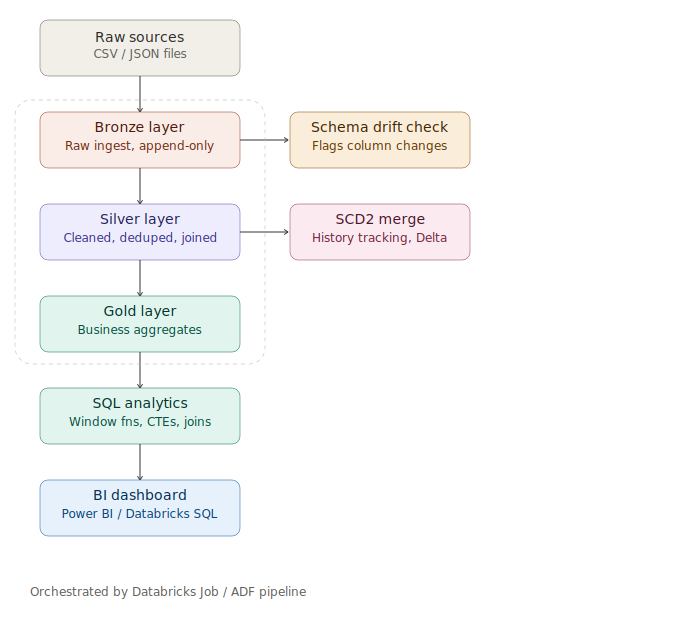

# DataFlow Inc. Medallion Pipeline

End-to-end data reliability platform built on Databricks using the **Medallion Architecture** (Bronze → Silver → Gold). Ingests raw e-commerce data, cleans and conforms it, detects schema drift, tracks dimension history with SCD Type 2, and exposes analytics-ready tables via SQL.

## Problem

Data scattered across raw CSV/JSON files, no central analytics layer, no schema drift detection, no data quality process, no historical tracking. This pipeline solves all four.

## Dataset

[Olist Brazilian E-Commerce Public Dataset](https://www.kaggle.com/datasets/olistbr/brazilian-ecommerce) — 9 relational tables, ~1.3M rows (orders, customers, products, sellers, payments, reviews, geolocation).

## Architecture



| Layer | Purpose | Tech |
|---|---|---|
| **Bronze** | Raw ingestion, append-only, schema-on-read | PySpark, Delta Lake |
| **Silver** | Cleaned, deduplicated, type-corrected, joined | PySpark |
| **Gold** | Business aggregates (sales, delivery, RFM, seller performance) | PySpark |
| **SCD2** | Dimension history tracking (customers, products) | Delta MERGE |
| **Schema drift** | Detects new/missing/changed columns between runs | PySpark + JSON snapshots |
| **SQL analytics** | Window functions, CTEs, joins on Silver tables | Spark SQL |
| **Orchestration** | Sequenced execution with dependency/failure handling | Azure Data Factory (design documented, see limitation below) |

## Repository structure

```
dataflow-medallion/
├── notebooks/
│   ├── 01_bronze_ingest.py       # Raw CSV -> Bronze Delta tables
│   ├── 02_silver_clean.py        # Cleaning, dedup, type fixes, joins
│   ├── 03_gold_aggregate.py      # Business aggregate tables
│   ├── 04_scd2_merge.py          # SCD Type 2 history tracking
│   └── 05_schema_drift_check.py  # Schema change detection
├── sql/
│   └── 06_sql_analytics.sql      # Window functions, CTEs, RFM segmentation
├── diagrams/
│   └── architecture.png          # Pipeline architecture diagram
├── docs/
│   ├── setup.md                  # Databricks setup & run instructions
│   └── adf_setup.md              # ADF orchestration design & setup guide
├── adf_pipeline.json             # ADF pipeline definition (5 chained notebook activities)
├── screenshots/                  # Databricks screenshots of each layer
└── README.md
```

## Key features

- **Bronze layer**: append-only raw ingestion with `_ingestion_timestamp` and `_source_file` lineage columns
- **Silver layer**: null handling, deduplication, zip-code normalization, category translation join
- **Gold layer**: sales by category, revenue by state, seller performance, customer RFM segmentation
- **SCD Type 2**: `effective_date`, `end_date`, `is_current` columns track dimension changes over time via Delta `MERGE INTO`
- **Schema drift detection**: compares current Bronze schema against last recorded snapshot, flags new/missing/type-changed columns
- **SQL analytics**: `RANK()`, `LAG()`, `ROW_NUMBER() OVER (PARTITION BY ...)`, CTEs, `CASE`-based customer segmentation (Loyal / Recent / At Risk / Churned)
- **Orchestration**: designed an ADF pipeline (`adf_pipeline.json`) chaining all 5 stages with success-dependency conditions, enforcing correct execution order automatically

## Setup

See [docs/setup.md](docs/setup.md) for Databricks setup and run order, and [docs/adf_setup.md](docs/adf_setup.md) for the ADF orchestration design.

## Known limitation

The ADF pipeline was fully designed and configured, but Databricks Free Edition doesn't expose a persistent cluster for ADF's Databricks Notebook activity to target, and free-tier Azure subscriptions don't provide compute quota for ADF-managed job clusters. As a result, live end-to-end orchestration couldn't be executed. The pipeline logic, linked service configuration, and dependency chaining shown in `adf_pipeline.json` and `docs/adf_setup.md` reflect exactly what would run unchanged on a standard (non-free) Azure Databricks workspace with Jobs/Workflows enabled. All 5 stages were validated by running the notebooks directly in Databricks.

## Tech stack

Python · Pandas · SQL · PySpark · Delta Lake · Databricks · Azure Data Factory (design)

## 👨‍💻 Author

Kapil Singhal <br>
Data Engineer
